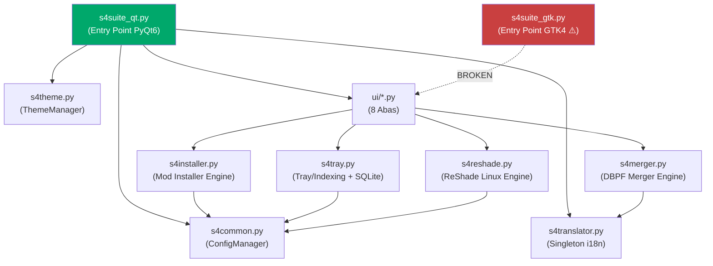

# 🔎 Análise Completa do Projeto S4Suite_Qt

> Projeto: **S4 Suite v2.0** — Gerenciador de mods para The Sims 4 no Linux  
> Stack: Python 3 + PyQt6 (com vestígio GTK4) | SQLite | 7z | DBPF Parser  
> Data da análise: 27/05/2026

---

## Visão Geral da Arquitetura



O projeto tem uma arquitetura **modular razoável**: módulos de backend separados da UI, um ConfigManager centralizado, e sistema de tradução via JSON. Porém, há problemas significativos que precisam ser corrigidos.

---

## 🔴 NÍVEL 1 — Bugs Críticos (Causam Crash ou Perda de Dados)

Estes devem ser corrigidos **imediatamente**.

### BUG-01: `NameError` no Config Tab — `os` não importado

**Arquivo:** [config_tab.py](file:///home/raell/Projetos/S4Suite_Qt/S4Suite_Qt/ui/config_tab.py#L172)

```python
def on_browse_game(self):
    start_dir = os.path.expanduser("~/Documentos")  # ❌ os nunca importado!
```

O módulo `os` é usado na linha 172 mas **não está nos imports do topo do arquivo**. Clicar em "📁 Procurar" na aba de configurações causa `NameError`. O import de `os` na linha 184 dentro de `on_autodetect` mascara parcialmente o problema.

**Correção:** Adicionar `import os` no topo do arquivo.

---

### BUG-02: `TypeError` no `__main__` do Installer quando `sims4_path` é `None`

**Arquivo:** [s4installer.py](file:///home/raell/Projetos/S4Suite_Qt/S4Suite_Qt/s4installer.py#L291)

```python
status, res = install_mod(sys.argv[1], ConfigManager.get("sims4_path") + "/Mods")
#                                      ^^^^^^^^^^^^^^^^^^^^^^^^^^^^^^^^^^^
#                                      None + "/Mods" → TypeError!
```

Se `sims4_path` não estiver configurado (primeira execução), isso lança `TypeError: unsupported operand type(s) for +: 'NoneType' and 'str'`.

**Correção:**
```python
sims_path = ConfigManager.get("sims4_path")
if not sims_path:
    print("Erro: sims4_path não configurado.")
    sys.exit(1)
status, res = install_mod(sys.argv[1], os.path.join(sims_path, "Mods"))
```

---

### BUG-03: Tratamento incorreto do retorno de `install_mod()` no TranslationWorker

**Arquivo:** [translations_tab.py](file:///home/raell/Projetos/S4Suite_Qt/S4Suite_Qt/ui/translations_tab.py#L22-L28)

```python
result = install_mod(self.path, self.trans_dir)
if result:  # ❌ Tupla não-vazia é SEMPRE True!
    self.finished_signal.emit(True, t("Tradução instalada com sucesso!"))
```

`install_mod()` retorna uma **tupla** `(status, msg)`. Uma tupla não-vazia é sempre truthy em Python, então `if result:` é **sempre `True`**, mesmo quando o status real é `False` ou `"NEEDS_DECISION"`.

**Correção:**
```python
status, msg = install_mod(self.path, self.trans_dir)
if status is True:
    self.finished_signal.emit(True, t("Tradução instalada com sucesso!"))
else:
    self.finished_signal.emit(False, msg or t("Falha ao instalar a tradução."))
```

---

### BUG-04: File handle vazando no Merger em caso de exceção

**Arquivo:** [s4merger.py](file:///home/raell/Projetos/S4Suite_Qt/S4Suite_Qt/s4merger.py#L70)

```python
current_out_f = open(current_out_path, "wb")  # Abre o arquivo...
# ... centenas de linhas de processamento ...
# Se Exception aqui → current_out_f NUNCA é fechado!
except Exception as e:
    log(t("❌ Erro fatal: {}").format(e))
    return False  # File handle vazou!
```

Se qualquer exceção ocorrer durante o merge, o arquivo de saída fica aberto, podendo causar **corrupção de dados** ou arquivos truncados no disco.

**Correção:** Usar `try/finally` ou refatorar para usar context manager.

---

### BUG-05: Estado do Worker não é resetado entre mods no InstallerWorker

**Arquivo:** [installer_tab.py](file:///home/raell/Projetos/S4Suite_Qt/S4Suite_Qt/ui/installer_tab.py#L187-L253)

Quando processando múltiplos mods, `self.user_selection` e `self.user_decision` de um mod anterior podem "vazar" para o próximo mod porque nunca são resetados no início de cada iteração do loop.

**Correção:** Adicionar no início do loop `for`:
```python
self.user_selection = None
self.user_decision = None
self.user_wants_careful_install = False
```

---

### BUG-06: Crash silencioso se `7z` não está instalado

**Arquivo:** [s4installer.py](file:///home/raell/Projetos/S4Suite_Qt/S4Suite_Qt/s4installer.py#L48-L65)

```python
res = subprocess.run(['7z', 'x', archive_path, ...])
```

Se `7z` não existir no PATH, `subprocess.run` levanta `FileNotFoundError`. O `except Exception` na linha 64 engole o erro silenciosamente e retorna lista vazia. O mesmo problema existe em [s4merger.py](file:///home/raell/Projetos/S4Suite_Qt/S4Suite_Qt/s4merger.py#L207), [s4reshade.py](file:///home/raell/Projetos/S4Suite_Qt/S4Suite_Qt/s4reshade.py#L55), e [s4tray.py](file:///home/raell/Projetos/S4Suite_Qt/S4Suite_Qt/s4tray.py#L170).

**Correção:** Verificar existência do `7z` na inicialização do app e mostrar mensagem clara.

---

## 🟠 NÍVEL 2 — Problemas de Alta Severidade (Segurança & Integridade)

### SEC-01: `is_safe_to_delete` não resolve symlinks

**Arquivo:** [s4common.py](file:///home/raell/Projetos/S4Suite_Qt/S4Suite_Qt/s4common.py#L69)

```python
target_abs = os.path.abspath(target_path)  # ❌ Não resolve symlinks!
```

Um symlink malicioso `Mods/evil_link → /home` passaria pela checagem de segurança. `os.path.abspath()` apenas normaliza o caminho sem resolver symlinks.

**Correção:** Usar `os.path.realpath()` em vez de `os.path.abspath()` em todo o módulo.

---

### SEC-02: Backup do ReShade é sobrescrito silenciosamente

**Arquivo:** [s4reshade.py](file:///home/raell/Projetos/S4Suite_Qt/S4Suite_Qt/s4reshade.py#L62-L63)

```python
if os.path.exists(dest_dll) and not os.path.exists(dest_dll + ".backup"):
    shutil.copy2(dest_dll, dest_dll + ".backup")
```

Na segunda instalação do ReShade, o `.backup` já existe (contendo a versão anterior do ReShade, não o DLL original). Assim, o backup original é **perdido permanentemente**.

**Correção:** Usar naming incremental (`dxgi.dll.backup.1`, `.backup.2`) ou verificar se o backup já é ReShade.

---

### SEC-02b: ReShade exclui DLLs legítimas do jogo

**Arquivo:** [s4reshade.py](file:///home/raell/Projetos/S4Suite_Qt/S4Suite_Qt/s4reshade.py#L67-L71)

```python
other_dlls = ["dxgi.dll", "d3d11.dll", "d3d9.dll"]
for d in other_dlls:
    if d != inject_name:
        path = os.path.join(game_bin_path, d)
        if os.path.exists(path): safe_remove(path)
```

Se o jogo tiver um `d3d11.dll` original da EA/Microsoft (não do ReShade), esse código **deleta o arquivo original** sem verificar a procedência. Pode quebrar o jogo se a DLL original for necessária.

**Correção:** Verificar hash/tamanho do DLL antes de deletar, ou só deletar se for sabidamente uma DLL do ReShade.

---

### SEC-03: `bare except` mascarando erros críticos

**Arquivos:** Múltiplos

| Arquivo | Linhas | Problema |
|---------|--------|----------|
| [s4tray.py](file:///home/raell/Projetos/S4Suite_Qt/S4Suite_Qt/s4tray.py#L75) | 75, 103, 119, 152 | `except: pass` / `except: continue` |
| [s4installer.py](file:///home/raell/Projetos/S4Suite_Qt/S4Suite_Qt/s4installer.py#L118) | 118 | `except: pass` |
| [organizer_tab.py](file:///home/raell/Projetos/S4Suite_Qt/S4Suite_Qt/ui/organizer_tab.py#L68) | 68, 100, 109 | `except: pass` |

Bare `except` captura **tudo**, incluindo `KeyboardInterrupt` e `SystemExit`. Isso mascara bugs reais e torna o debug impossível.

**Correção:** Usar `except Exception as e:` e logar o erro.

---

### CSS-01: Seletores CSS `.ClassName` não funcionam no Qt StyleSheet

**Arquivo:** [s4theme.py](file:///home/raell/Projetos/S4Suite_Qt/S4Suite_Qt/s4theme.py#L54-L78)

```css
QPushButton.SidebarBtn { ... }   /* ❌ Não funciona no Qt! */
QFrame.StatCard { ... }           /* ❌ Também não! */
```

O PyQt6/Qt **não suporta** seletores CSS por classe (`.ClassName`). O `setProperty("class", "SidebarBtn")` define uma *dynamic property*, não uma classe CSS. O seletor correto seria:
```css
QPushButton[class="SidebarBtn"] { ... }
QFrame[class="StatCard"] { ... }
```

> [!CAUTION]
> Isso significa que **toda a estilização da sidebar e dos cards do dashboard estão sem efeito!** Os botões e cards estão usando o estilo padrão em vez do tema personalizado.

---

### MATCH-01: Matching de nomes de mods é perigosamente agressivo

**Arquivo:** [s4installer.py](file:///home/raell/Projetos/S4Suite_Qt/S4Suite_Qt/s4installer.py#L98)

```python
if new_b and exist_base and (new_b == exist_base or new_b in exist_base or exist_base in new_b):
```

O uso de `in` para substring matching é extremamente perigoso. Se `new_b` for `"mod"`, vai dar match com **qualquer** mod cujo nome limpo contenha `"mod"` (ex: `"modern_house"`, `"model_sim"`, etc.). Pode causar **deleção acidental de mods não relacionados** durante atualização.

**Correção:** Usar comparação mais rigorosa (ex: Levenshtein distance, ou pelo menos exigir ratio mínimo de similaridade).

---

### THR-01: Mistura de primitivas de threading com QThread

**Arquivo:** [installer_tab.py](file:///home/raell/Projetos/S4Suite_Qt/S4Suite_Qt/ui/installer_tab.py#L178-L185)

```python
import threading

class InstallerWorker(QThread):
    def __init__(self, ...):
        self.wait_event = threading.Event()  # ❌ Misturando frameworks

    def wait_for_ui(self):
        self.wait_event.clear()
        self.wait_event.wait()  # Bloqueia a QThread
```

Usar `threading.Event` dentro de um `QThread` é desencorajado e pode causar problemas de compatibilidade. O correto seria usar `QMutex` + `QWaitCondition`.

---

## 🟡 NÍVEL 3 — Problemas de Performance & Qualidade

### SIG-01: `finished_signal` do ReShade não conectado

**Arquivo:** [reshade_tab.py](file:///home/raell/Projetos/S4Suite_Qt/S4Suite_Qt/ui/reshade_tab.py#L164-L166)

```python
self.rs_worker = ReshadeInstallWorker(game_bin, inject_name)
self.rs_worker.log_signal.connect(self.append_log)
self.rs_worker.start()  # ❌ finished_signal nunca conectado!
```

O `finished_signal` do `ReshadeInstallWorker` nunca é conectado. O usuário não recebe feedback visual de conclusão, e os botões não são desabilitados durante a operação (podendo iniciar múltiplas instalações simultâneas).

---

### I18N-01: Diretório de backup hardcoded em português

**Arquivo:** [dashboard_tab.py](file:///home/raell/Projetos/S4Suite_Qt/S4Suite_Qt/ui/dashboard_tab.py#L64)

```python
backup_dir = os.path.expanduser("~/Documentos/S4Suite_Backups")
```

O caminho `~/Documentos` é específico para sistemas em português. Em sistemas em inglês seria `~/Documents`. Deveria usar `xdg.BaseDirectory` ou `GLib.get_user_special_dir()` para detectar automaticamente.

---

### PERF-01: ConfigManager carrega JSON do disco a cada chamada

**Arquivo:** [s4common.py](file:///home/raell/Projetos/S4Suite_Qt/S4Suite_Qt/s4common.py#L40-L43)

```python
@staticmethod
def get(key, default=None):
    config = ConfigManager.load()  # ❌ Lê e parseia o JSON inteiro!
    return config.get(key, default)
```

`ConfigManager.get()` é chamado **dezenas de vezes** durante a inicialização (tema, tradutor, cada aba, auto-detect do ReShade, etc.). Cada chamada abre, lê e parseia o arquivo JSON completo do disco.

**Correção:** Implementar cache em memória com pattern Singleton:
```python
class ConfigManager:
    _cache = None
    
    @classmethod
    def load(cls):
        if cls._cache is None:
            cls._cache = cls._load_from_disk()
        return cls._cache
    
    @classmethod
    def save(cls, data):
        cls._cache = data
        cls._save_to_disk(data)
```

---

### PERF-02: Busca do Organizador itera TODOS os items a cada keystroke

**Arquivo:** [organizer_tab.py](file:///home/raell/Projetos/S4Suite_Qt/S4Suite_Qt/ui/organizer_tab.py#L411-L431)

```python
def on_search(self, text):
    for item in self.all_items_flat:  # ❌ Pode ter 10k+ items!
        ...
```

Para pastas Mods grandes (10.000+ arquivos), isso causa lag perceptível na digitação.

**Correção:** Usar `QTimer.singleShot(300, ...)` para debounce e processar em chunks.

---

### PERF-03: `populate_tree_recursive` roda na main thread

**Arquivo:** [organizer_tab.py](file:///home/raell/Projetos/S4Suite_Qt/S4Suite_Qt/ui/organizer_tab.py#L369-L397)

A construção do `QTreeWidget` (linhas 369-397) roda na main thread. Para árvores com muitos nós, isso congela a UI.

---

### PERF-04: Merger abre o mesmo arquivo repetidamente no `write_chunk`

**Arquivo:** [s4merger.py](file:///home/raell/Projetos/S4Suite_Qt/S4Suite_Qt/s4merger.py#L234)

```python
for i, (key, res) in enumerate(sorted_by_file):
    with open(res['fpath'], "rb") as src_f:  # ❌ Abre/fecha a cada recurso!
```

Para milhares de recursos do mesmo arquivo, isso causa overhead massivo de I/O. Deveria manter um cache de file handles agrupados por `fpath`.

---

### DUP-01: Código duplicado

| O que está duplicado | Onde |
|---|---|
| `resource_path()` | [s4suite_qt.py:27](file:///home/raell/Projetos/S4Suite_Qt/S4Suite_Qt/s4suite_qt.py#L27) e [s4translator.py:6](file:///home/raell/Projetos/S4Suite_Qt/S4Suite_Qt/s4translator.py#L6) |
| Parser DBPF | [s4merger.py:94-150](file:///home/raell/Projetos/S4Suite_Qt/S4Suite_Qt/s4merger.py#L94-L150) e [s4tray.py:77-104](file:///home/raell/Projetos/S4Suite_Qt/S4Suite_Qt/s4tray.py#L77-L104) |
| `append_log()` | [installer_tab.py:352](file:///home/raell/Projetos/S4Suite_Qt/S4Suite_Qt/ui/installer_tab.py#L352), [merger_tab.py:145](file:///home/raell/Projetos/S4Suite_Qt/S4Suite_Qt/ui/merger_tab.py#L145), [tray_tab.py:134](file:///home/raell/Projetos/S4Suite_Qt/S4Suite_Qt/ui/tray_tab.py#L134), [reshade_tab.py:138](file:///home/raell/Projetos/S4Suite_Qt/S4Suite_Qt/ui/reshade_tab.py#L138) |
| `format_size()` | Definida isoladamente em [dashboard_tab.py:12](file:///home/raell/Projetos/S4Suite_Qt/S4Suite_Qt/ui/dashboard_tab.py#L12) |
| Concatenação `sims4_path + "/Mods"` | Repetida ~5x em vez de usar `get_mods_dir()` |

---

## ⚪ NÍVEL 4 — Problemas de Organização & Qualidade de Código

### ORG-01: Arquivo GTK4 com imports PyQt6

**Arquivo:** [s4suite_gtk.py](file:///home/raell/Projetos/S4Suite_Qt/S4Suite_Qt/s4suite_gtk.py#L13-L18)

```python
from ui.installer_tab import InstallerTab  # ❌ Isso é QWidget (PyQt6)!
```

O `s4suite_gtk.py` importa tabs que são `QWidget` do PyQt6 e tenta usá-las num app GTK4/Adwaita. Isso causaria crash imediato ao executar. Este arquivo parece ser um resquício de uma versão anterior e está **completamente quebrado**.

> [!WARNING]
> **Decisão necessária:** Remover `s4suite_gtk.py` ou reescrever as tabs com GTK4 widgets?

---

### ORG-02: Código morto no ReShade Tab

**Arquivo:** [reshade_tab.py](file:///home/raell/Projetos/S4Suite_Qt/S4Suite_Qt/ui/reshade_tab.py#L150)

```python
def on_copy_command(self):
    clipboard = self.window().windowHandle().screen().virtualSiblings()[0].virtualSiblings()
    # ^^^ Essa linha não faz nada! O resultado é descartado.
    from PyQt6.QtWidgets import QApplication
    QApplication.clipboard().setText(self.entry_code.text())
```

Linha 150 é código morto (provavelmente um teste antigo). E a linha 6 importa `QClipboard` sem usar.

---

### ORG-03: Import de `shutil` no meio do arquivo

**Arquivo:** [s4common.py](file:///home/raell/Projetos/S4Suite_Qt/S4Suite_Qt/s4common.py#L63)

```python
# ... linha 63 ...
import shutil  # ❌ Deveria estar no topo (PEP 8)
```

---

### ORG-04: Variável duplicada

**Arquivo:** [tray_tab.py](file:///home/raell/Projetos/S4Suite_Qt/S4Suite_Qt/ui/tray_tab.py#L58-L59)

```python
self.selected_files = []
self.selected_files = []  # ❌ Duplicado!
```

---

### ORG-05: JunkCleaner usa `os.remove()` em vez de `safe_remove()`

**Arquivo:** [organizer_tab.py](file:///home/raell/Projetos/S4Suite_Qt/S4Suite_Qt/ui/organizer_tab.py#L98)

```python
os.remove(os.path.join(root, f))  # ❌ Bypass da proteção safe_remove!
```

O `JunkCleanerWorker` ignora a proteção de segurança de `safe_remove()` ao deletar arquivos de lixo.

---

### ORG-06: Internacionalização inconsistente

Várias strings de log/debug estão hardcoded em português:

| Arquivo | Linha | String |
|---------|-------|--------|
| [organizer_tab.py](file:///home/raell/Projetos/S4Suite_Qt/S4Suite_Qt/ui/organizer_tab.py#L270) | 270 | `f"Erro ao mover script {script}: {e}"` |
| [organizer_tab.py](file:///home/raell/Projetos/S4Suite_Qt/S4Suite_Qt/ui/organizer_tab.py#L467) | 467 | `f"Erro ao alternar mod: {e}"` |
| [organizer_tab.py](file:///home/raell/Projetos/S4Suite_Qt/S4Suite_Qt/ui/organizer_tab.py#L499) | 499 | `f"Erro ao mover {src}: {e}"` |

---

## 📋 Itens Ausentes no Projeto

| Item | Impacto |
|------|---------|
| `requirements.txt` ou `pyproject.toml` | Impossível reproduzir o ambiente |
| Testes unitários | Zero cobertura de testes |
| Módulo de logging (`logging`) | Usa `print()` em todo lugar |
| Verificação de dependências externas (`7z`) | Crash silencioso se faltar |
| `.gitignore` | `__pycache__`, `build/`, `dist/` podem estar no repo |
| Parser DBPF unificado | Implementado 2x de formas diferentes |
| Classe base para tabs | Código repetido em 4+ tabs |

---

## 🗺️ Priorização Recomendada

### Sprint 1 — Correções Urgentes (Crashes + UI Quebrada)
1. ⚡ Corrigir **CSS-01** — Seletores CSS da sidebar e cards não funcionam (tema visual quebrado!)
2. Corrigir **BUG-01** — Import `os` faltando no config_tab (crash ao clicar Procurar)
3. Corrigir **BUG-03** — Retorno de `install_mod` tratado errado no TranslationWorker
4. Corrigir **BUG-04** — File handle leaking no merger (corrupção de dados)
5. Corrigir **BUG-05** — Estado não resetado entre mods no InstallerWorker
6. Remover código morto (**ORG-02** reshade clipboard hack, **ORG-04** variável duplicada)
7. Conectar `finished_signal` do ReShade (**SIG-01**)

### Sprint 2 — Segurança & Robustez
8. Corrigir **SEC-01** — Usar `os.path.realpath()` para resolver symlinks
9. Corrigir **SEC-02b** — ReShade não deve deletar DLLs sem verificar origem
10. Corrigir **MATCH-01** — Matching de mods via substring causa deleção acidental
11. Substituir todos os `bare except` (**SEC-03**)
12. Verificar `7z` na inicialização (**BUG-06**)
13. Corrigir backup incremental do ReShade (**SEC-02**)
14. Criar `requirements.txt`

### Sprint 3 — Performance & Refatoração
15. Implementar cache no ConfigManager (**PERF-01**)
16. Debounce na busca do Organizador (**PERF-02**)
17. Unificar parser DBPF (**DUP-01**)
18. Criar `BaseTab` com funcionalidade comum
19. Cache de file handles no Merger (**PERF-04**)
20. Corrigir diretório de backup hardcoded (**I18N-01**)

### Sprint 4 — Qualidade & Futuro
21. Implementar módulo de logging
22. Decidir sobre o arquivo GTK (**ORG-01**) — remover ou reescrever
23. Adicionar testes unitários
24. Aplicar tema imediatamente ao trocar (sem restart)
25. Adicionar type hints (PEP 484)

---

> [!TIP]
> O projeto tem uma base sólida e muitas funcionalidades bem pensadas (anti-malware, smart update, TGI sort, dedup via MD5, detecção de ambiente Linux). Os problemas encontrados são típicos de um projeto em desenvolvimento ativo e são todos corrigíveis sem grandes refatorações arquiteturais.
